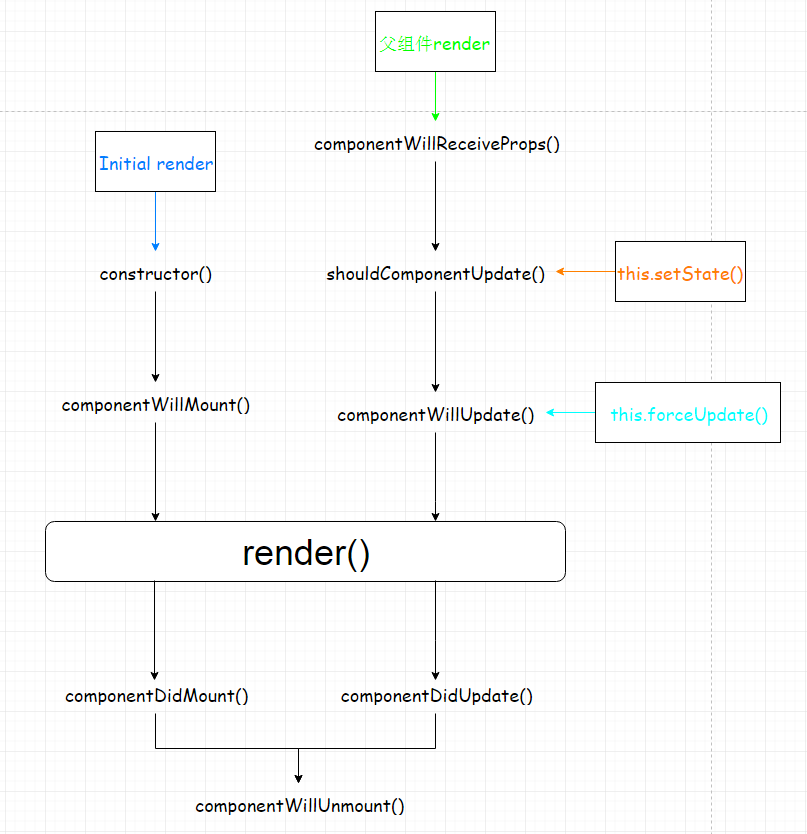

# React 核心
## 1.state 管理组件内部的方法（异步操作）

state是react的核心. 在react中要有与之前不同的**思想**:有变换就不要写固定值,写在state里,然后根据满足的条件来改变。

state写在constructor(){this.state{num:0}},这样代码加载完就会执行。

#### 改变state的方法：setState()

更新state时，会执行render,也就会重新渲染页面(不操作dom)

prevState是setState里的一个参数:可以拿到修改之前的state里的值
```js
handleclick(){
        this.setState( prevState=>({num:prevState.num+10}))
    }
```
---
 console.log()可以取代alert()或document.write()，在网页脚本中使用console.log()时，会在浏览器控制台打印出信息。

console.dir()可以显示一个对象所有的属性和方法。

---
## 2.ref 拿到真实的dom节点

根据 React 的设计，所有的 DOM 变动，都先在虚拟 DOM 上发生，然后再将实际发生变动的部分，反映在真实 DOM上，这种算法叫做 DOM diff ，它可以极大提高网页的性能表现。

React支持一个特殊的属性，你可以将这个属性加在任何通过render()返回的组件中。因为react中拿到的都是虚拟dom ,而ref可以拿到实例。

- ref字符串使用

    this.refs.A(只能拿字符串，不能拿变量，将淘汰不使用)
- ref回调函数
```js
ref属性也可以是一个回调函数。
这个函数将要在组件被挂载之后立即执行。即当render()执行后才能拿到dom节点，才可以操作。
这里需要注意，当这个参照组件被卸载并且这个ref改变的时候，先前的ref的参数值将为null。这将有效的防止了内存的泄露。
```
eg.获取焦点
```js
<input placeholder='haha' ref={input => this.input=input}/>
第一个：形参
第二个：组件的属性
第三个：实参 拿到节点
this.input.focus()
```
---
## 3.props 组件与组件间的沟通
单项数据流：只能父级往子级传
组件App里有组件Btn,App为父组件
```js
创建父组件的js中：Btn加一个属性A
创建子组件的js中：{this.prop.A}
变量为数字用{}，字符串`${}`
```

在创建子组件的js中：将父组件中所有定义过的属性全部写进去（this.props）,然后再写子组件本身默认的属性.defaultProps

安装好propTypes包，可以规定写入参数的数据类型
```js
Btn.propTypes={
    title:PropTypes.string,
    pad:PropTypes.number
}
```
#### children(特殊的props)
```js
父组件：
<Card>
    <h1>fhdsjgh</h1>
    <h1>fhdsjgh</h1>
    <h1>fhdsjgh</h1>
    <h1>fhdsjgh</h1>
</Card>
子组件：
{this.props.children} 写在标签的内部
```
---
## 4.component lifecycle[组件生命周期]

### 1)Mounting 首次组件挂载

    创建了组件后就有的方法

- constructor()

    初始化，在创建组件的时候调用，只有一次。
- componentWillMount()

    在组件挂载之前调用，只有一次。（这个阶段可以设置state）
- render()

    首次渲染。
    除了首次render之后调用componentDidMount，其它render结束之后都是调用componentDidUpdate。
- componentDidMount()

    在组件挂载之后调用，只有一次。此时dom已经生成了，子组件也全部渲染完毕。

### 2)Updating 更新阶段
    state、props改变时触发，每次更新渲染后都会被调用。

- componentWillReceiveProps(nextProps)

    父组件发生render的时候子组件就会调用componentWillReceiveProps（不管props有没有更新，也不管父子组件之间有没有数据交换）。
- shouldComponentUpdate(nextProps,nextState)

    每次调用setState后都会调用shouldComponentUpdate判断是否需要重新渲染组件。默认返回true，继续执行。返回false，停止页面更新(但state仍会改变)
- componentWillUpdate(nextProps, nextState)
    shouldComponentUpdate 返回true或者调用forceUpdate之后调用
- render()

- componentDidUpdate(prevProps, prevState)

    除了首次render之后调用componentDidMount，其它render结束之后都是调用componentDidUpdate。

### 3)Unmounting 销毁

- componentWillUnmount()

    组件被卸载的时候调用。一般在componentDidMount里面注册的事件需要在这里删除。


在react中，触发render的有4条路径。

1）首次渲染Initial Render

2）调用this.setState （并不是一次setState会触发一次render，React可能会合并操作，再一次性进行render）

3）父组件发生更新（一般就是props发生改变，但是就算props没有改变或者父子组件之间没有数据交换也会触发render）

4）调用this.forceUpdate

如图：


---
## 5.Form

### Controlled Components(受控组件)

    符合React的数据流
    数据存储在state中，便于使用
    便于对数据进行处理

#### input Tag
    在input标签中，我们给加上value值时，会发现无论输入(选择)什么，表单中所有的值都不变，仍为之前的value值。这种情况必须要通过**onChange**去修改state值。

#### textarea Tag
    textarea中，value值加在<textarea>内，不是像之前一样加在子节点上。

#### select Tag
    之前是在option上加checked,现在是在<select>中加value

### Uncontrolled Components(非受控组件)
    之前我们说过加了value值会无法改变，必须配合onChange事件。但是我们也可以写为defaultValue，这样value值会发生改变
```js
<input type="text" defaultValue="HelloWorld"/>
```
    但是这种情况中，如果我们想要获得value值，它是一直不变的，要想获得即时的value，需要通过ref找到真实的dom ,然后再拿value.
##### 总结：（代码在form.js中可以看到）
- 受控：

    有了value必须通过onChange去修改state值

    拿值时：直接拿this.state.value
- 非受控：

    defaultValue 不需要onChange可以改变
    拿值时：直接拿不到，先找到dom-->给个ref  this.input.value
### Handling Multiple Inputs 操作多个表单

    经过上面学习，我们可以发现这种操作特别麻烦，代码中(文件form.js)我们给每一个表单元素绑定一个不同的onChange事件，做不到函数复用，因此我们做了调整（文件MultipleForm.js），使所有表单用同一个onChange事件。

    主要思想：给每一个表单元素添加了name属性，在state中每一个表单元素的value值所对应的属性名=name的名字。

    类似这种情况：
    ```js
    这里主要运用了一个对象赋值 属性名+属性值都为变量的情况：
    let name='aa'
    let obj={[name]:10}
    console.log(obj); //aa:10
    obj['bb']=20 // aa:10,bb:20
    obj['cc']=30 //aa:10,bb:20,cc:30
    ```
    在这里我们写为:
    ```js
    this.setState({[target.name]:value})
    ```
    当然对于checkbox来说，它要使用的值是checked，所以要做一次三目运算。
    ```js
    let value= target.name==='checkbox' ? target.checked : target.value
    ```
#### 补充：

    action:提交到指定地址  即使不添加地址，提交也会刷新页面

    阻止刷新页面：onSubmit

```js
<form onSubmit={this.handleSubmit.bind(this)}>
    <input name='age'/>
    <button>提交</button>
</form>

handleSubmit(e){
    e.preventDefault() //阻止跳转
    e.target.reset() //提交后清空
}
[注]：当受控时state变化，清空不了
```
